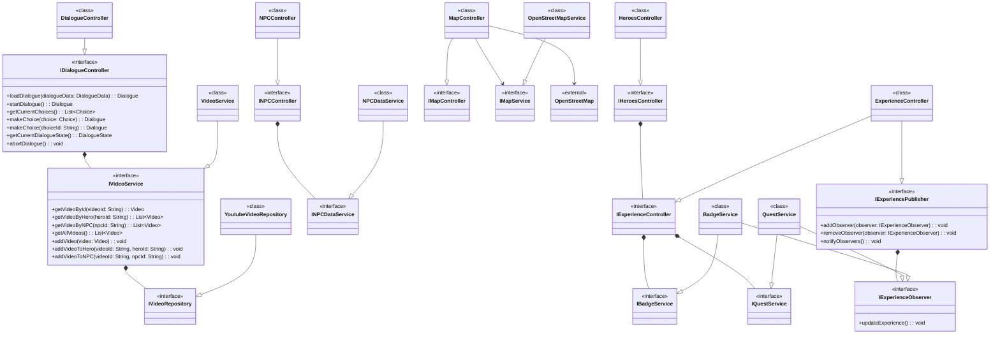

```mermaid
classDiagram
    %% Dialogue Package
    class IDialogueController {
        <<interface>>
        +loadDialogue(dialogueData: DialogueData): Dialogue
        +startDialogue(): Dialogue
        +getCurrentChoices(): List~Choice~
        +makeChoice(choice: Choice): Dialogue
        +makeChoice(choiceId: String): Dialogue
        +getCurrentDialogueState(): DialogueState
        +abortDialogue(): void
    }

    class DialogueController {
        <<class>>
    }
    DialogueController --|> IDialogueController

    class IVideoService {
        <<interface>>
        +getVideoById(videoId: String): Video
        +getVideoByHero(heroId: String): List~Video~
        +getVideoByNPC(npcId: String): List~Video~
        +getAllVideos(): List~Video~
        +addVideo(video: Video): void
        +addVideoToHero(videoId: String, heroId: String): void
        +addVideoToNPC(videoId: String, npcId: String): void
    }

    class VideoService {
        <<class>>
    }
    VideoService --|> IVideoService

    class IVideoRepository {
        <<interface>>
    }

    class YoutubeVideoRepository {
        <<class>>
    }
    YoutubeVideoRepository --|> IVideoRepository

    IVideoService *-- IVideoRepository

    IDialogueController *-- IVideoService

    %% NPC Package
    class INPCController {
        <<interface>>
    }

    class NPCController {
        <<class>>
    }
    NPCController --|> INPCController

    class INPCDataService {
        <<interface>>
    }

    class NPCDataService {
        <<class>>
    }
    NPCDataService --|> INPCDataService

    INPCController *-- INPCDataService

    %% Map Package
    class IMapController {
        <<interface>>
    }

    class MapController {
        <<class>>
    }
    MapController --|> IMapController

    class IMapService {
        <<interface>>
    }

    class OpenStreetMapService {
        <<class>>
    }
    OpenStreetMapService --|> IMapService

    MapController --> IMapService

    class OpenStreetMap {
        <<external>>
    }
    MapController --> OpenStreetMap

    %% Heroes Package
    class IHeroesController {
        <<interface>>
    }

    class HeroesController {
        <<class>>
    }
    HeroesController --|> IHeroesController

    class IExperienceController {
        <<interface>>
    }

    class ExperienceController {
        <<class>>
    }
    ExperienceController --|> IExperienceController
    ExperienceController --|> IExperiencePublisher

    class IExperienceObserver {
        <<interface>>
        +updateExperience(): void
    }

    class IExperiencePublisher {
        <<interface>>
        +addObserver(observer: IExperienceObserver): void
        +removeObserver(observer: IExperienceObserver): void
        +notifyObservers(): void
    }

    class IBadgeService {
        <<interface>>
    }

    class IQuestService {
        <<interface>>
    }

    class BadgeService {
        <<class>>
    }
    BadgeService --|> IExperienceObserver
    BadgeService --|> IBadgeService

    class QuestService {
        <<class>>
    }
    QuestService --|> IExperienceObserver
    QuestService --|> IQuestService

    IHeroesController *-- IExperienceController

    IExperienceController *-- IQuestService
    IExperienceController *-- IBadgeService

    IExperiencePublisher *-- IExperienceObserver
```
