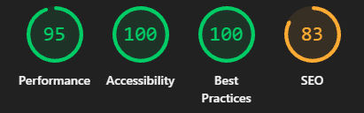
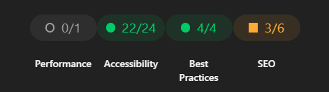

## Qualité

### Accessibilité

L'accessibilité a été prise en compte dans la structure générale de l'interface :

- les images possèdent un texte alternatif lorsqu'il est pertinent ;
- les boutons utilisent des éléments HTML identifiables ;
- les contenus de dialogue sont présentés dans une structure lisible ;
- l'interface s'adapte aux écrans mobiles et aux tablettes.

La conformité complète au RGAA n'a pas été vérifiée point par point. Une passe dédiée serait nécessaire pour contrôler notamment le contraste, la navigation au clavier, les annonces de changement de contenu et le comportement des vidéos.

---

### Éco-conception

L'application ne possède pas de backend et repose sur un nombre limité de dépendances externes. Une fois installée comme PWA, elle peut réutiliser une partie de ses ressources localement et éviter certains téléchargements répétés.

Les vidéos YouTube restent une exception : elles sont chargées depuis un service externe et ne peuvent pas être mises en cache de la même manière que les assets du projet. Une intégration locale serait envisageable avec l'autorisation et les ressources de France Travail.

Les cartes Leaflet et leurs tuiles constituent également un poste à surveiller. Une gestion plus fine du cache et du nombre de tuiles chargées permettrait de réduire l'utilisation mémoire et les requêtes réseau.

---

### Performance

Le projet est une SPA relativement légère. Les principaux efforts ont porté sur deux sujets.

#### Organisation du code

La suppression des dépendances cachées et la réduction de l'utilisation du singleton facilitent la maîtrise du cycle de vie des objets. L'application ne crée plus une seconde architecture parallèle pour les tests ou la console : `ApplicationContainer` construit le graphe principal, puis `GameManager` expose les instances utiles pour l'inspection.

Additionellement il serait envisageable d'exclure le GameManager du build afin d'alleger la charge de ce dernier

#### Médias

Les vidéos de présentation sont préchargées lorsque cela est possible afin de réduire le temps d'attente lors de l'ouverture d'un dialogue. Les vidéos YouTube restent dépendantes du réseau et de leur propre temps de chargement.

#### Mesure

Les scores Lighthouse doivent être relevés sur le build de production servi localement, et non sur le serveur de développement. Le livrable peut être lancé avec `npm run build`, puis `npm run preview`.

Des améliorations restent possibles, notamment sur le poids des médias, les tuiles Leaflet et le nombre de composants créés dès le chargement initial.

---

### Référencement

L'application étant un serious game principalement interactif, le référencement n'était pas le sujet principal du projet. La structure HTML et les textes visibles restent néanmoins importants pour fournir une base correcte : titres hiérarchisés, textes alternatifs et contenu compréhensible sans dépendre uniquement des images.

Une stratégie SEO plus complète pourrait ajouter des métadonnées, une description adaptée, des données structurées et une page d'accueil mieux indexable.

---

### Sécurité

L'application ne gère pas de compte utilisateur, de données personnelles, de formulaire métier ou de base de données. La surface d'attaque est donc limitée, mais cela ne dispense pas des précautions de base.

Les contenus affichés depuis les données sont traités avec attention, notamment dans les dialogues où le texte utilisateur ne doit pas être injecté directement comme du HTML. Les dépendances externes, les vidéos et les iframes restent des points à contrôler.

Les avertissements liés aux cookies, à la politique CSP et aux permissions d'iframe proviennent principalement du lecteur YouTube intégré. Les permissions inutiles de l'iframe ont été retirées, mais les messages générés à l'intérieur d'un contenu tiers ne sont pas entièrement contrôlables depuis l'application.

---

[← Page précédente : Stratégie de tests](08_Strategie-de-tests.md) | [Page suivante : Organisation →](10_Organisation.md)
